# **Attic Shop**

*Attic Shop* is a e-commerce project dedicated to cameras, lenses and accessories for them. All visitors can buy products, create their own user profile to start adding products to their wishlist and leave reviews. All reviews need approval by *Attic Shop* website owner so everyone can feel safe from abuse, inappropriate language, etc. The approvals are being made from website UI pages that only is accessed by website owner.

This website was created for Portfolio Project #5 - Diploma in Full Stack Software Development Diploma at the [Code Institute](https://www.codeinstitute.net).

[View live website here](https://atticstore-95ba3f90b672.herokuapp.com/)


# Contents

* [**Strategy**](<#strategy>)

    * [Site User Goals](<#site-user-goals>)
    
    * [Site Owner Goals](<#site-owner-goals>)
    
    * [Target Audience](#target-audience)
    
    * [Business Model](#business-model)
    
    * [SEO](#seo)
    
    * [Marketing](#marketing)
    
    * [Project Management](<#project-management>)

* [**User Experience (UX)**](<#user-experience-ux>)

    * [User Stories](<#user-stories>)

    * [Site Structure](<#site-structure>)

    * [Design Choices](<#design-choices>)

* [**Existing Features**](<#existing-features>)

    * [Navigation](<#navigation>)

    * [Search](<#search>)

    * [Pagination](<#pagination>)

    * [Products](<#products>)

    * [Wishlist](<#wishlist>)

    * [Shopping Bag](<#shopping-bag>)

    * [Checkout Page](<#checkout-page>)

    * [Order Confirmation Page](<#order-confirmation-page>)

    * [Profile Page](<#profile-page>)

    * [Reviews](<#reviews>)

    * [Rating](<#rating>)

    * [Reviews Approval](<#reviews-approval>)

    * [Create Product](<#create-product>)

    * [Edit Product](<#edit-product>)

    * [Delete Product](<#delete-product>)
    
    * [Admin Page](<#admin-page>)
    
    * [Sign Up](<#sign-up>)
    
    * [Sign In](<#sign-in>)

    * [Sign Out](<#sign-out>)

    * [Footer](<#footer>)

    * [Flash Messages](<#flash-messages>)

    * [Email Confirmation](<#email-confirmation>)

* [**Features Left to Implement**](<#features-left-to-implement>)

* [**Technologies Used**](<#technologies-used>)

    * [Languages](<#languages>)

    * [Frameworks & Software](<#frameworks--software>)

    * [Libraries](<#libraries>)

* [**Testing**](<#testing>)

    * [Testing User Stories](<#testing-user-stories>)

    * [Code Validation](<#code-validation>)
    
    * [Manual Testing](<#manual-testing>)
    
    * [Responsiveness Test](<#responsiveness-test>)
    
    * [Browser Compatibility](<#browser-compatibility>)
    
    * [Lighthouse](<#lighthouse>)
    
    * [Peer Review](<#peer-review>)

    * [Known Bugs](<#known-bugs>)

* [Deployment](<#deployment>)

    * [Deployment To Heroku](<#deployment-to-heroku>)

    * [Forking The Repository On GitHub](<#forking-the-repository-on-github>)

    * [Cloning And Setting Up This Project](<#cloning-and-setting-up-this-project>)

* [Credits](<#credits>)

* [Acknowledgements](<#acknowledgements>)

# Strategy

## Site User Goals

- Selecting products
- Searching for products
- Buying products
- Register or Login
- Review product
- Add product to the wishlist

## Site Owner Goals

- Sell products
- Get people to subscribe
- Promote own business
- Add products
- Edit products
- Delete products

## Target Audience

- Professional photographers
- Amateur photographers
- Experimental photographers
- Fans of rare film cameras

[Back to top](<#contents>)

## Business Model

*Attic Shop* is designed as a minimalistic shop for cameras directly selling to the consumer (B2C). The user can order their products online and then the products will be shipped to them.

There is the subscribtion for the future for discounts and the newsletter with information about new cameras, lenses and accessories.

The most popular social platforms Facebook and Instagram are used to communicate with potential buyers.

## SEO

Keywords, title and description meta tags have been added for SEO.

Descriptive urls have been used for the main site navigation to be more SEO friendly.

File `robots.txt` created to improve SEO.

File `sitemap.xml` created with [Free Online Sitemap Generator](https://www.xml-sitemaps.com/).

[Back to top](<#contents>)

## Marketing

### Facebook

There is a Facebook page for *Attic Shop*. The shop can post new products and advertise discounts with the Facebook instruments.

[View live Attic Shop Facebook page here](https://www.facebook.com/atticcamerashop/)

<details><summary><b>Facebook Page</b></summary>


</details><br/>

### Instagram

There is an Instagram page for *Attic Shop*. The shop can post new products and advertise discounts with the Instagram instruments.

[View live Attic Shop Instagram page here](https://www.instagram.com/cherdackshopblog/)

<details><summary><b>Instagram Page</b></summary>


</details><br/>

### Newsletter

Users can subscribe to a newsletter to stay up to date with what is happening and get dicounts. Service provided by [Mailchimp](https://mailchimp.com/).

<details><summary><b>Newsletter</b></summary>


</details><br/>

### Additional

There is the possibilities for more social media pages and running google ads to increase visibility.
Contests could be hosted to win prices and bring more people to join the newsletter.

## Project Management

### Github Board
I've been using the project board in GitHub to keep my project together. It helped me structure up my work. GitHub was used to plan and organize my user stories.

<details><summary><b>User Stories</b></summary>


</details><br/>

[Back to top](<#contents>)

### Database Schema
I've used a modelling tool called [Graph Models](https://django-extensions.readthedocs.io/en/latest/graph_models.html) to create the database schema. It shows the relationships between the different models in the database connected to the application. Graph Models exports a *.png file which visualize models.

Models used (besides standard user model) in this project are:

* **Category** - Handles all the categories in the products application.
* **Product** - Handles all the products for categories in the products application.
* **Review** - Handles all the reviews for products in the products application.
* **SizeCategory** - Handles type of size for their categiry in the products application.
* **ProductSize** - Handles all the product sizes for their size category in the products application.
* **Wishlist** - Handles all the products in the wishlist of user in the wishlist application.
* **UserProfile** - Handles all the profiles for users in the profiles application.
* **Order** - Handles all the orders for user profile in the checkout application.
* **OrderLineItem** - Handles all the items for the order in the checkout application.

<details><summary><b>Database Schema Small</b></summary>


</details><br/>

<details><summary><b>Database Schema Full</b></summary>


</details><br/>

[Back to top](<#contents>)

# **User Experience (UX)**

## User Stories
Below the user stories for the project are listed to clarify why particular feature matters. These will then be tested and confirmed in the [Testing](<#testing>) section.

### Site User

| Role | Case |  |
|:-------:|:--------|:--------|
| As a Site User | I can view a list of products so that I can select one to view | &check; |
| As a Site User | I can view a paginated list of products so that easily select a page to view | &check; |
| As a Site User | I can click on a product so that I can read the full description | &check; |
| As a Site User | I can register an account so that I can use additional functionality | &check; |
| As a Site User | I can sign out from the site so that I can be safe that nobody can access my information | &check; |
| As a Site User | I can search for products so that I can filter products that match my interests | &check; |
| As a Site User | I can edit amount of product items so that I can add this amount to the bag at once | &check; |
| As a Site User | I can add products to the shopping bag so that I can buy them later | &check; |
| As a Site User | I can edit amount of product items in the bag so that I can buy this amount at once | &check; |
| As a Site User | I can add products to the wishlist so that I can add them to the shopping bag later | &check; |
| As a Site User | I can see my profile so that I can edit my delivery details | &check; |
| As a Site User | I can see order history so that I can control my purchases | &check; |
| As a Site User | I can go to chackout page so that I can make a payment | &check; |
| As a Site User | I can see order information page so that I have confirmation of payment | &check; |
| As a Site User | I can write a review so that I can share my opinion about the product | &check; |
| As a Site User | I can sort products by different characteristics so that I can easily choose product I want to buy | &check; |
| As a Site User | I can rate the product so that I can influence on product raiting | &check; |
| As a Site User | I can view specific category so that I can look for products only in that category | &check; |
| As a Site User | I can remove item from the bag so that I can discard bying them | &check; |
| As a Site User | I can see massages about editing my shopping bag so that I can confim success of my actions | &check; |
| As a Site User | I can see products in the bag in the success message so that I can be sure product is added or removed from the bag | &check; |
| As a Site User | I can enter payment information so that I can check out | &check; |
| As a Site User | I can be sure my personal and payment information is safe and secure so that I can confidently provide the needed information to make a purchase | &check; |
| As a Site User | I can receive an email confirmation after checking out so that I can keep the information of what I've purchased for my records | &check; |
| As a Site User | I can get an email confirmation so that I can be sure my order details is saved | &check; |

### Store Owner

| Role | Case |  |
|:-------:|:--------|:--------|
| As a Store Owner | I can add a product to the store so that I can expand the range of products | &check; |
| As a Store Owner | I can edit a product so that I can keep a product up to date | &check; |
| As a Store Owner | I can delete a product so that I can remove irrelevant products | &check; |
| As a Store Owner | I can approve draft reviews so that I can keep reviews polite and actual | &check; |

[Back to top](<#contents>)

## Site Structure

The *Attic Shop* site has: **Home Page** for *announcements*, **Products Page** for *products*, **Wishlist** for *products to add to the bag later*, **Shopping Bag** for *products to create an order*, **Checkout Page** for *order to pay*, and **Profile Page** for *profile details*.

The functionality is alo different **when the user is signed out** and **when the user is signed in**. Depending on login status different pages is available for the user.

When the user is signed out the pages: *Sign In*, *Sign Up*, *Home*, *Products*, and *Shopping Bag* are avaliable. Dropdown menu without username shows: *Sign In*, and *Sign Up* links.

When the user is signed in dropdown menu with username shows: *Profile*, *Wishlist*, and *Sign Out* links. 

If you are signed in as an administrator an *admin area* is available: *Create Product*, and *Review List*.

The site has an minimalistic, clean and intuitive design that makes the site easy to navigate for the user.

Read more about the different choices in the [Features](<#features>) section.

[Back to top](<#contents>)

## Design Choices

### Color Scheme

The color scheme chosen for the *Attic Shop* site is contrast black and white with interactive elements based on the Bootstrap 4.6 default colours. The colors are chosen in such a way that the background contrasts with the elements with which you can interact, the color of the buttons reflects their purpose, and the use of the functionality is as intuitive as possible. All colors are very clean and they create a professional look together and offers a good readability and contrast as well. I used the online service [Coolors](https://coolors.co/) to choose the color scheme.

<details><summary><b>Color Palette Image</b></summary>


</details><br/>

### Typography
The font used for the site are one of the most popular fonts: 'Lato'. Lato is a humanist sans-serif typeface designed by Łukasz Dziedzic. It was released in 2010. The name "Lato" is Polish for "summer". Fallback font is sans-serif.

[Back to top](<#contents>)

## **Existing Features**

### **Navigation**
The navigation bar is very clean and straight forward. Depending if you are signed in or not different menus are visible for the site user. An extra menu item is visible if you are signed in as an administrator.

* Promotion Bar - Latest promotion at the *Attic Shop*

<details><summary><b>Promotion Bar</b></summary>


</details><br/>

*Links that are visible to signed out users*

* Logo - Link to a Home Page.
* Dropdown Menu:
    * Sign Up - Gives the user the opportunity to sign up at the *Attic Shop*.
    * Sign In - Gives the user the opportunity to sign in a registered user at the *Attic Shop*.
* Shopping Bag - Lists of products ready for purchase.

<details><summary><b>Navigation Desktop - User Signed Out</b></summary>


</details><br/>

<details><summary><b>Navigation Mobile - User Signed Out</b></summary>


</details><br/>

*Links that are visible to signed in users*

* Logo - Link to a Home Page.
* Username dropdown list:
    * Profile - Shows signed in users profile page.
    * Wishlist - Lists all products added to the wishlist.
    * Sign out - Logs out the user.
* Shopping Bag - Lists of products ready for purchase.

<details><summary><b>Navigation Desktop - User Signed In</b></summary>


</details><br/>

<details><summary><b>Navigation Mobile - User Signed In</b></summary>


</details><br/>

*Link that is visible if user is administrator*

All of the links above plus the ones below.

* Create Product - From for adding a new product.
* Review List - Lists all draft reviews pending approval.

<details><summary><b>Navigation Desktop - Admin signed In</b></summary>

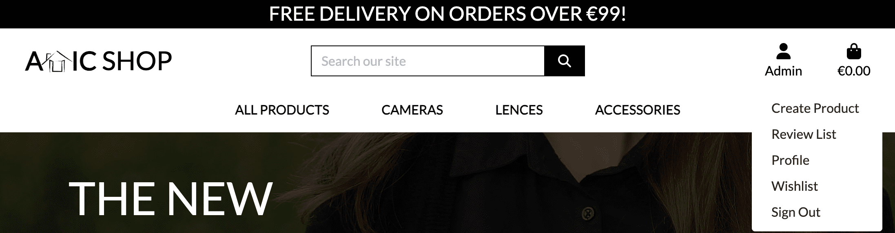
</details><br/>

<details><summary><b>Navigation Mobile Blog - Admin / Staff signed In</b></summary>


</details><br/>

[Back to top](<#contents>)

### **Search**

This is a convenient way to search for products of interest. It's available on all pages showing the list of products for everyone.

<details><summary><b>Search</b></summary>


</details><br/>

[Back to top](<#contents>)

### **Sorting**

There are to ways to sort products.

#### Sorting links under the main navigation panel

* All Products
    * By Price
    * By Rating
    * All Products

<details><summary><b>Sorting All Products</b></summary>


</details><br/>

* Cameras
    * Digital Cameras
    * Film Cameras
    * All Cameras

<details><summary><b>Sorting Cameras</b></summary>


</details><br/>

* Lenses
    * Lenses
    * Adapters & Caps
    * Lenses & Accessories

<details><summary><b>Sorting Lenses</b></summary>


</details><br/>

* Accessories
    * Specials
    * Tripods
    * Caps
    * Adapters
    * Flashlights
    * Other Accessories
    * All Accessories

<details><summary><b>Sorting Accessories</b></summary>


</details><br/>

#### Sorting dropdown menu at the Products Page

* Sort by...
* Price (low to high)
* Price (high to low)
* Rating (low to high)
* Rating (high to low)
* Name (A-Z)
* Name (Z-A)
* Category (A-Z)
* Category (Z-A)

<details><summary><b>Sorting Dropdown closed</b></summary>


</details><br/>

<details><summary><b>Sorting Dropdown opened</b></summary>


</details><br/>

[Back to top](<#contents>)

### **Pagination**
Pagination has buttons: *first page*, *previous page*, *next page*, and *last page*. Pagination takes into account search results and when turning pages, only the page corresponding to the search results is flipped.

<details><summary><b>Pagination</b></summary>


</details><br/>

[Back to top](<#contents>)

### **Products**

This page lists all the products that has been create at *Attic Shop*. For signed in and not signed in users this page looks the same. The page shows 12 cards before a pagination mechanism kicks in.

<details><summary><b>Products</b></summary>


</details><br/>

[Back to top](<#contents>)

### **Wishlist**

This page lists all the products that has been added to the wishlist by logged user. For not signed in users this page isn't available.

<details><summary><b>Wishlist</b></summary>


</details><br/>

[Back to top](<#contents>)

### **Shopping bag**

This page lists all the products that has been added to the shopping bag. For signed in and not signed in users this page looks the same.

<details><summary><b>Shopping bag</b></summary>


</details><br/>

[Back to top](<#contents>)

### **Checkout Page**

This page lists all the products that has been added to the shopping bag forming an order, shows the form for delivery details and provides security way to pay with the [Stripe](https://stripe.com/en-ie). For not signed in users form on this page will be always empty.

<details><summary><b>Checkout Page</b></summary>

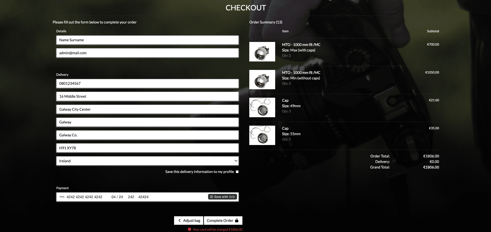
</details><br/>

[Back to top](<#contents>)

### **Order Confirmation Page**

This page shows order details after successfull payment. It appears after clicking an order number in order history at Profile Page as well, with notification that this is a past confirmation.

<details><summary><b>Order Confirmation Page</b></summary>

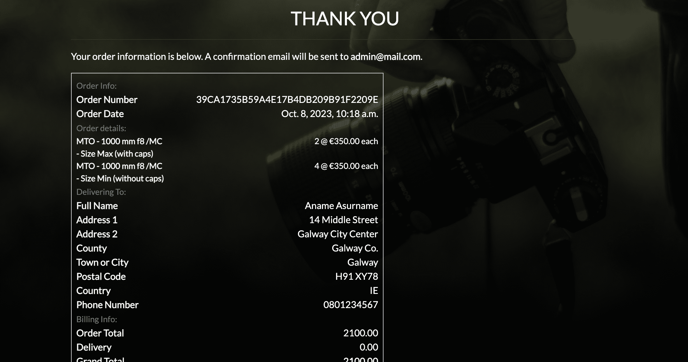
</details><br/>

[Back to top](<#contents>)

### **Profile Page**

This page shows delivery details and order history. For not signed in users this page isn't available.

<details><summary><b>Profile Page</b></summary>

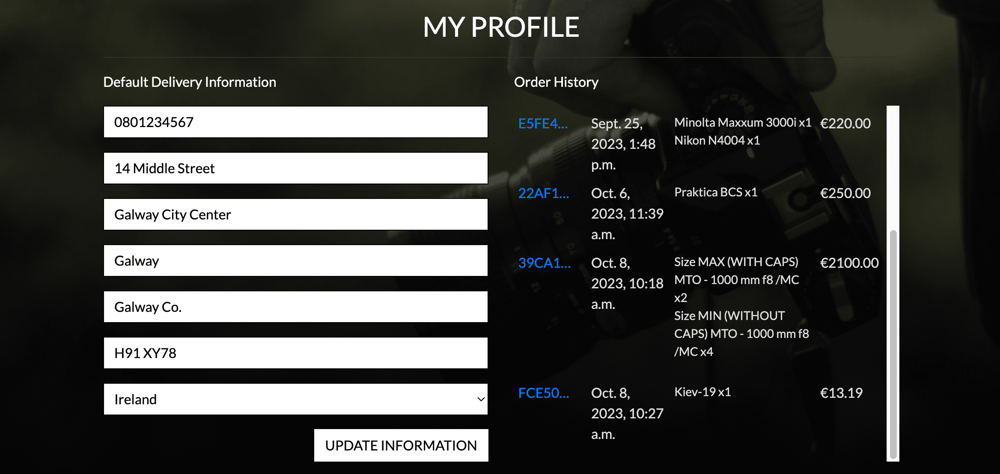
</details><br/>

[Back to top](<#contents>)

### **Reviews**

Signed in user can review each product. After approval it will appear on this products page. Each user can delete their own reviews.

<details><summary><b>Reviews</b></summary>


</details><br/>

[Back to top](<#contents>)

### **Rating**

There are two ratings for each product: from the store and from the reviews. Rating from the store is set up when creating or editing a product. Rating from reviews appears if a product has approved reviews.

<details><summary><b>Rating</b></summary>


</details><br/>

[Back to top](<#contents>)

### **Reviews Approval**

Site Owner can approve or delete draft reviews.

<details><summary><b>Reviews Approval</b></summary>


</details><br/>

[Back to top](<#contents>)

### **Create Product**

Site Owner can create products.

<details><summary><b>Create Product</b></summary>


</details><br/>

[Back to top](<#contents>)

### **Edit Product**

Site Owner can edit products.

<details><summary><b>Edit Product</b></summary>


</details><br/>

[Back to top](<#contents>)

### **Delete Product**

Site Owner can delete products.

<details><summary><b>Delete Product</b></summary>

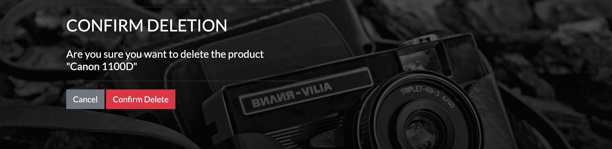
</details><br/>

[Back to top](<#contents>)

### **Admin Page**

This page is available only for superusers by url [/admin](https://atticstore-95ba3f90b672.herokuapp.com/admin/). On this page the administrator (or other superuser decided by *Attic Shop*) can *approve* / *delete* reviews; *create* / *edit* and *delete* products. General information about *number of users*, *number of reviews*, *number of products*, *number of categories*, *unapproved reviews* is also being showed on the page. Also Site Owner can create, update or delete Size Categories and Sizes on this page.

<details><summary><b>Admin Page</b></summary>


</details><br/>

[Back to top](<#contents>)

### **Sign Up**

If the site visitor hasn't registered user at the *Attic Shop* they can sign up.

<details><summary><b>Sign Up</b></summary>


</details><br/>

[Back to top](<#contents>)

### **Sign In**

On this page the user can sign in to the *Attic Shop*.

<details><summary><b>Sign In</b></summary>


</details><br/>

[Back to top](<#contents>)

### **Sign Out**

When the user clicks sign out in the dropdown menu a confirmation page is being showed so that the user don't accidently sign out.

<details><summary><b>Sign Out</b></summary>


</details><br/>

[Back to top](<#contents>)

### **Footer**

The footer area includes Newsletter Subscribtion form powered by [Mailchimp](https://mailchimp.com/), and external links to the: [Facebook Page](https://www.facebook.com/atticcamerashop/) of the store, [Instagram Page](https://www.instagram.com/cherdackshopblog/) of the store, [Creator GitHub Account](https://github.com/Sergii-Kostanets), and [Privacy Policy](https://www.privacypolicygenerator.info/live.php?token=adajRuJvNQt8Ha9xD9xU8ZvmTDXKSZIV) of the *Atic Shop*.

<details><summary><b>Footer</b></summary>


</details><br/>

[Back to top](<#contents>)

### **Flash Messages**

The site incorporates flash messages when an action has been performed (i.e. create/update/delete actions). Examples of this in the screenshots below.

<details><summary><b>Confirmation Messages</b></summary>


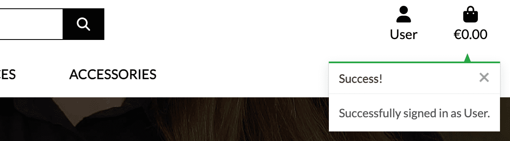
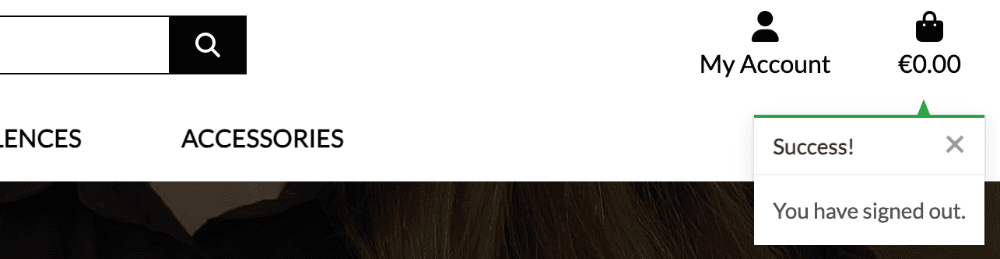
</details><br/>

[Back to top](<#contents>)

### **Email Confirmation**

The site incorporates real email confirmation for account registration and email for order summary.

<details><summary><b>Registration Confirmation Email</b></summary>


</details><br/>

<details><summary><b>Order Summary Email</b></summary>


</details><br/>

[Back to top](<#contents>)

## Features Left to Implement

* Add functionality to add/edit/delete size categories and sizes of products from website UI.
* Add functionality to add/edit/delete categories from website UI.
* Add likes to the reviews.
* Add functionality to add several images of each product, add slider to view all images.
* Add functionality to add products to the bag directly from the wishlist.
* Add 3rd party social account providers (Google, Facebook, Twitter, GitHub, etc).
* Add editing and deliting reviews for review author.

[Back to top](<#contents>)

# Technologies Used

## Languages

* [Python](https://en.wikipedia.org/wiki/Python_(programming_language)) - Provides the functionality for the site.
* [HTML5](https://en.wikipedia.org/wiki/HTML) - Provides the content and structure for the website.
* [CSS3](https://en.wikipedia.org/wiki/CSS) - Provides the styling for the website.
* [JavaScript](https://en.wikipedia.org/wiki/JavaScript) - Provides interactive elements of the website

## Frameworks & Software
* [Bootstrap](https://getbootstrap.com/) - A CSS framework that helps building solid, responsive, mobile-first sites
* [Django](https://www.djangoproject.com/) - A model-view-template framework used to create the Review | Alliance site
* [GitHub](https://github.com/) - Used to control versions of the website.
* [GitBash](https://en.wikipedia.org/wiki/Bash_(Unix_shell)) - Terminal used to push changes to the GitHub repository.
* [Heroku](https://en.wikipedia.org/wiki/Heroku) - A cloud platform that the application is deployed to.
* [Lighthouse](https://developer.chrome.com/docs/lighthouse/overview/) - Used to test performance of site.
* [Am I Responsive](https://ui.dev/amiresponsive/) - Used for responsiveness check.
* [Graph Models](https://django-extensions.readthedocs.io/en/latest/graph_models.html) - Used to create a *.png file of all models in the project.
* [Favicon](https://favicon.io/) - Used to create the favicon.
* [VSCode](https://code.visualstudio.com/) - Used to create and edit the site.
* [Google Chrome DevTools](https://developer.chrome.com/docs/devtools/) - Used to debug and test responsiveness.
* [Amazon Web Services](https://aws.amazon.com/) - A service S3 that hosts all static files in the project.
* [HTML Validation](https://validator.w3.org/) - Used to validate HTML code
* [CSS Validation](https://jigsaw.w3.org/css-validator/) - Used to validate CSS code
* [CI Python Linter](https://pep8ci.herokuapp.com/) - the PEP8 Online Validaton service form Codeinstitute.
* [JSHint Validation](https://jshint.com/) - Used to validate JavaScript code

[Back to top](<#contents>)

## Libraries

The libraries used in this project are located in the requirements.txt file and have been documented below

* [asgiref](https://pypi.org/project/asgiref/) - ASGI is a standard for Python asynchronous web apps and servers to communicate with each other, and positioned as an asynchronous successor to WSGI.
* [astroid](https://pypi.org/project/astroid/) - The aim of this module is to provide a common base representation of python source code. It is currently the library powering pylint’s capabilities.
* [boto3](https://pypi.org/project/boto3/) - BBoto3 is the Amazon Web Services (AWS) Software Development Kit (SDK) for Python, which allows Python developers to write software that makes use of services like Amazon S3 and Amazon EC2.
* [botocore](https://pypi.org/project/botocore/) - A low-level interface to a growing number of Amazon Web Services. The botocore package is the foundation for the AWS CLI as well as boto3.
* [certifi](https://pypi.org/project/certifi/) - Certifi is a Python package that provides a curated collection of Root Certificates for validating the trustworthiness of SSL/TLS connections.
* [charset-normalizer](https://pypi.org/project/charset-normalizer/) - Charset Normalizer is a Python library that helps normalize and detect the character encoding of text. It provides functions to handle and convert text between different character encodings.
* [defusedxml](https://pypi.org/project/defusedxml/) - DefusedXML is a library that provides modified versions of the standard Python XML libraries to mitigate various security vulnerabilities. It helps protect against XML attacks such as entity expansion, external entity injection, and other XML parsing vulnerabilities.
* [dj-database-url](https://pypi.org/project/dj-database-url/) - Django Database URL is a Django module that allows you to utilize environment variables or a URL to configure your database settings. It provides a convenient way to manage and switch between different database configurations.
* [Django](https://pypi.org/project/Django/) - Django is a high-level Python web framework that encourages rapid development and clean, pragmatic design.
* [django-allauth](https://pypi.org/project/django-allauth/) - Integrated set of Django applications addressing authentication, registration, account management as well as 3rd party (social) account authentication.
* [django-countries](https://pypi.org/project/django-countries/) - A Django application that provides country choices for use with forms, flag icons static files, and a country field for models.
* [django-crispy-forms](https://pypi.org/project/django-crispy-forms/) - Used to integrate Django DRY forms in the project.
* [django-extensions](https://pypi.org/project/django-extensions/) - Django Extensions is a collection of custom extensions for the Django Framework.
* [django-storages](https://pypi.org/project/django-storages/) - Django Storages is a project to provide a variety of storage backends in a single library.
* [flake8](https://pypi.org/project/flake8/) - Flake8 is a wrapper around these tools: PyFlakes, pycodestyle, Ned Batchelder’s McCabe script. Flake8 runs all the tools by launching the single flake8 command. It displays the warnings in a per-file, merged output.
* [flake8-django](https://pypi.org/project/flake8-django/) - A flake8 plugin to detect bad practices on Django projects.
* [gunicorn](https://pypi.org/project/gunicorn/) - Gunicorn ‘Green Unicorn’ is a Python WSGI HTTP Server for UNIX. It’s a pre-fork worker model ported from Ruby’s Unicorn project. The Gunicorn server is broadly compatible with various web frameworks, simply implemented, light on server resource usage, and fairly speedy.
* [idna](https://pypi.org/project/idna/) - IDNA (Internationalized Domain Names in Applications) is a Python library that provides support for working with internationalized domain names. It helps encode and decode domain names to and from ASCII-compatible encoding.
* [jmespath](https://pypi.org/project/jmespath/) - JMESPath (pronounced “james path”) allows to declaratively specify how to extract elements from a JSON document.
* [lazy-object-proxy](https://pypi.org/project/lazy-object-proxy/) - A fast and thorough lazy object proxy.
* [mccabe](https://pypi.org/project/mccabe/) - Ned’s script to check McCabe complexity. This module provides a plugin for flake8, the Python code checker.
* [oauthlib](https://pypi.org/project/oauthlib/) - OAuthLib is a framework which implements the logic of OAuth1 or OAuth2 without assuming a specific HTTP request object or web framework.
* [packaging](https://pypi.org/project/packaging/) - Reusable core utilities for various Python Packaging interoperability specifications.
* [Pillow](https://pypi.org/project/Pillow/) - The Python Imaging Library adds image processing capabilities to your Python interpreter. This library provides extensive file format support, an efficient internal representation, and fairly powerful image processing capabilities.
* [psycopg2](https://pypi.org/project/psycopg2/) - Psycopg is the most popular PostgreSQL database adapter for the Python programming language. Its main features are the complete implementation of the Python DB API 2.0 specification and the thread safety (several threads can share the same connection). It was designed for heavily multi-threaded applications that create and destroy lots of cursors and make a large number of concurrent “INSERT”s or “UPDATE”s.
* [pycodestyle](https://pypi.org/project/pycodestyle/) - It is a tool to check Python code against some of the style conventions in PEP 8.
* [pydot](https://pypi.org/project/pydot/) - It is an interface to Graphviz
can parse and dump into the DOT language used by GraphViz, is written in pure Python, and networkx can convert its graphs to pydot.
* [pyflakes](https://pypi.org/project/pyflakes/) - A simple program which checks Python source files for errors. Pyflakes analyzes programs and detects various errors. It works by parsing the source file, not importing it, so it is safe to use on modules with side effects. It’s also much faster.
* [pygraphviz](https://pypi.org/project/pygraphviz/) - PyGraphviz is a Python interface to the Graphviz graph layout and visualization package. With PyGraphviz you can create, edit, read, write, and draw graphs using Python to access the Graphviz graph data structure and layout algorithms.
* [pyparsing](https://pypi.org/project/pyparsing/) - The pyparsing module is an alternative approach to creating and executing simple grammars, vs. the traditional lex/yacc approach, or the use of regular expressions. The pyparsing module provides a library of classes that client code uses to construct the grammar directly in Python code.
* [python-dateutil](https://pypi.org/project/python-dateutil/) - The dateutil module provides powerful extensions to the standard datetime module, available in Python.
* [python3-openid](https://pypi.org/project/python3-openid/) - OpenID support for modern servers and consumers.
* [pytz](https://pypi.org/project/pytz/) - This is a set of Python packages to support use of the OpenID decentralized identity system in your application, update to Python 3.
* [requests](https://pypi.org/project/requests/) - Requests is a popular Python library for making HTTP requests. It provides a simple and intuitive interface for sending HTTP/1.1 requests, handling responses, and working with HTTP sessions.
* [requests-oauhlib](https://pypi.org/project/requests-oauthlib/) - Provides first-class OAuth library support for Requests.
* [s3transfer](https://pypi.org/project/s3transfer/) - S3transfer is a Python library for managing Amazon S3 transfers. This project is maintained and published by Amazon Web Services.
* [six](https://pypi.org/project/six/) - Six is a Python module that provides a compatibility layer for bridging differences between Python 2 and Python 3. It allows developers to write code that works across both versions of Python.
* [sqlparse](https://pypi.org/project/sqlparse/) - sqlparse is a non-validating SQL parser for Python. It provides support for parsing, splitting and formatting SQL statements.
* [stripe](https://pypi.org/project/stripe/) - A Python library for Stripe’s API.
* [typing_extensions](https://pypi.org/project/typing-extensions/) - The typing_extensions module serves two related purposes: Enable use of new type system features on older Python versions. For example, typing.TypeGuard is new in Python 3.10, but typing_extensions allows users on previous Python versions to use it too. Enable experimentation with new type system PEPs before they are accepted and added to the typing module.
* [urllib3](https://pypi.org/project/urllib3/) - Urllib3 is a powerful HTTP client library for Python. It provides a high-level interface for making HTTP requests, handling headers, cookies, redirects, and other aspects of the HTTP protocol.
* [wrapt](https://pypi.org/project/wrapt/) - The aim of the wrapt module is to provide a transparent object proxy for Python, which can be used as the basis for the construction of function wrappers and decorator functions.

[Back to top](<#contents>)

# Testing

## Testing User Stories

### Site User

| Role | Test case / Result |  |
|:-------:|:--------|:--------|
| As a Site User | I can view a list of products so that I can select one to view | &check; |
|  | By clicking on the all products or shop now button or by entering /products in the URL, the user goes to a page with a list of all products |  |
| As a Site User | I can view a paginated list of products so that easily select a page to view | &check; |
|  | The User is able to navigate trough products pages with the buttins: next page, last page, previous page, and first page |  |
| As a Site User | I can click on a product so that I can read the full description | &check; |
|  | User is able to click on the product image to go to the product detail page |  |
| As a Site User | I can register an account so that I can use additional functionality | &check; |
|  | An anonymous user sees a Sign Up button, clicking on which is redirected to the registration page |  |
| As a Site User | I can sign out from the site so that I can be safe that nobody can access my information | &check; |
|  | The logged-in user sees a Sign Out button, which is signing user out after confirmation |  |
| As a Site User | I can search for products so that I can filter products that match my interests | &check; |
|  | User can enter request to the search input and filter products |  |
| As a Site User | I can edit amount of product items so that I can add this amount to the bag at once | &check; |
|  | User is able to edit number of items on the product detail page |  |
| As a Site User | I can add products to the shopping bag so that I can buy them later | &check; |
|  | User can click add to bag button to add product to the bag |  |
| As a Site User | I can edit amount of product items in the bag so that I can buy this amount at once | &check; |
|  | User can edit number of items in the bag |  |
| As a Site User | I can add products to the wishlist so that I can add them to the shopping bag later | &check; |
|  | Clicking to add to wishlist button will add product to the wishlist |  |
| As a Site User | I can see my profile so that I can edit my delivery details | &check; |
|  | User can edit their details on profile page, by clicking profile button in the dropdown menu of the main navigation panel |  |
| As a Site User | I can see order history so that I can control my purchases | &check; |
|  | After purchase user can see details about it on profile page |  |
| As a Site User | I can go to chackout page so that I can make a payment | &check; |
|  | On shopping bag page clicking secure checkout button user gets to the checkout page for payment |  |
| As a Site User | I can see order information page so that I have confirmation of payment | &check; |
|  | After purchase user can see details about their order |  |
| As a Site User | I can write a review so that I can share my opinion about the product | &check; |
|  | User can add a review on product detail page |  |
| As a Site User | I can sort products by different characteristics so that I can easily choose product I want to buy | &check; |
|  | User can choose sort type on product list page |  |
| As a Site User | I can rate the product so that I can influence on product raiting | &check; |
|  | User can vote to rate the product |  |
| As a Site User | I can view specific category so that I can look for products only in that category | &check; |
|  | User can choose category from navigation panel to filter products by this category |  |
| As a Site User | I can remove item from the bag so that I can discard bying them | &check; |
|  | In the shopping bag user can click the remove button on each product to delete it from the bag |  |
| As a Site User | I can see massages about editing my shopping bag so that I can confim success of my actions | &check; |
|  | User can see messsage after adding, editing or deleting product from shopping bag |  |
| As a Site User | I can see products in the bag in the success message so that I can be sure product is added or removed from the bag | &check; |
|  | Success message has a list of products are currently in the bag |  |
| As a Site User | I can enter payment information so that I can check out | &check; |
|  | User can enter payment information in the special field formatted for this |  |
| As a Site User | I can be sure my personal and payment information is safe and secure so that I can confidently provide the needed information to make a purchase | &check; |
|  | User provides all information being logged, without access to it another users |  |
| As a Site User | I can receive an email confirmation after checking out so that I can keep the information of what I've purchased for my records | &check; |
|  | User gets an email after successful payment for theirs order |  |
| As a Site User | I can get an email confirmation so that I can be sure my order details is saved | &check; |
|  | User gets an email with order details after payment |  |

### Site Owner

| Role | Test case / Result |  |
|:-------:|:--------|:--------|
| As a Store Owner | I can add a product to the store so that I can expand the range of products | &check; |
|  | Store Owner can create new products in the form accessable by Create Product link in the dropdown menu |  |
| As a Store Owner | I can edit a product so that I can keep a product up to date | &check; |
|  | Store Owner can edit product by clicking Edit link at product card |  |
| As a Store Owner | I can delete a product so that I can remove irrelevant products | &check; |
|  | Store Owner can delete products by clicking Delete link at product card |  |
| As a Store Owner | I can approve draft reviews so that I can keep reviews polite and actual | &check; |
|  | Site owner can access Draft Reviews List page by Review List button in dropdown account menu and delete or approve each draft review |  |

[Back to top](<#contents>)

## Code Validation
The code on the *Atic Shop* site has been tested through [W3C HTML Validator](https://validator.w3.org/), [W3C CSS Validator](https://jigsaw.w3.org/css-validator/) and [JS hint Validator](https://jshint.com/). There are no errors found.

### HTML Validation
When validating my own code the [W3C HTML Validator](https://validator.w3.org/) eports no errors.

<details><summary><b>HTML Validation Result Home page</b></summary>


</details><br/>

<details><summary><b>HTML Validation Result Products page</b></summary>


</details><br/>

<details><summary><b>HTML Validation Result Product Detail page</b></summary>

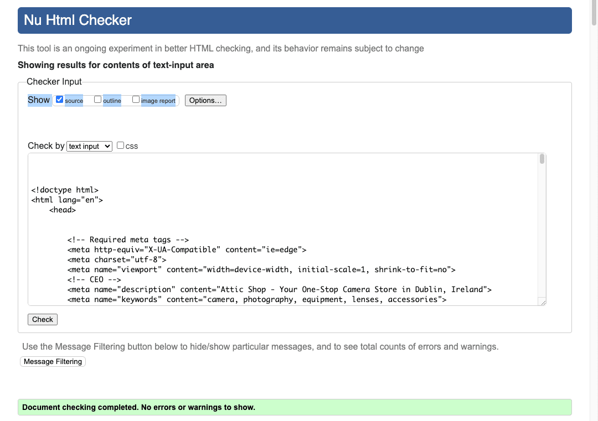
</details><br/>

<details><summary><b>HTML Validation Result Shopping Bag page</b></summary>


</details><br/>

<details><summary><b>HTML Validation Result Checkout page</b></summary>


</details><br/>

<details><summary><b>HTML Validation Result Order Confirmation page</b></summary>


</details><br/>

<details><summary><b>HTML Validation Result Wishlist</b></summary>


</details><br/>

<details><summary><b>HTML Validation Result Review list</b></summary>


</details><br/>

<details><summary><b>HTML Validation Result Profile page</b></summary>


</details><br/>

<details><summary><b>HTML Validation Result Create Product</b></summary>


</details><br/>

<details><summary><b>HTML Validation Result Edit Product</b></summary>


</details><br/>

<details><summary><b>HTML Validation Result Delete Product</b></summary>


</details><br/>

[Back to top](<#contents>)

### CSS Validaton
When validating my own code the [W3C CSS Validator](https://jigsaw.w3.org/css-validator/) reports no errors.

<details><summary><b>CSS Validation Result Base</b></summary>


</details><br/>

<details><summary><b>CSS Validation Result Checkout</b></summary>


</details><br/>

<details><summary><b>CSS Validation Result Profile</b></summary>


</details><br/>

[Back to top](<#contents>)

### PEP Validation

Python code was validated according to PEP8 using the [CI Python Linter](https://pep8ci.herokuapp.com/) and [Flake8](https://pypi.org/project/flake8/). Some errors were ignored as not affecting the project.

<details><summary><b>PEP Validation Result Not Ignoring Errors</b></summary>

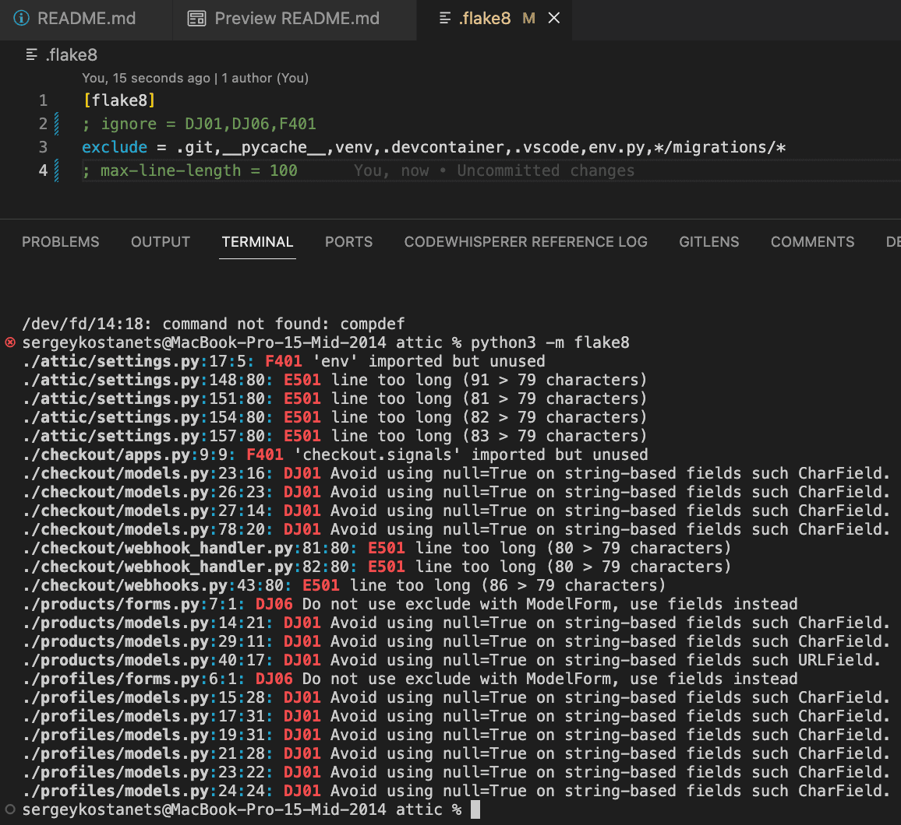
</details><br/>

<details><summary><b>PEP Validation Result Ignoring Errors</b></summary>

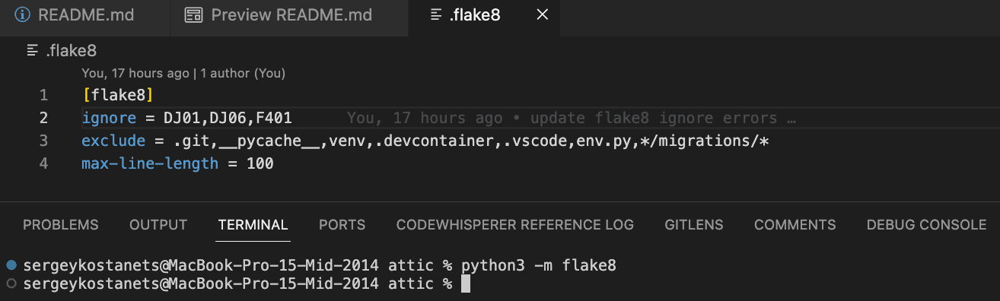
</details><br/>

[Back to top](<#contents>)

### JavaScript Validation

I validated all scripts in the templates. The most complex logic is in separate files.
The [JS hint Validator](https://jshint.com/) results can be seen below. No critical errors were returned when passing through JSHint.

<details><summary><b>JSHint Validation Result Stripe</b></summary>

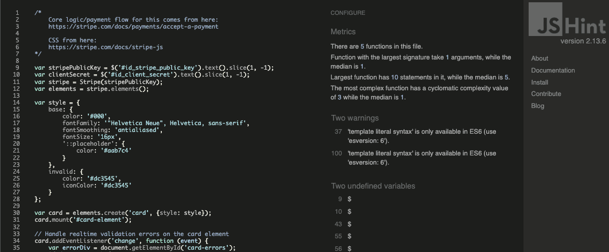
</details><br/>

<details><summary><b>JSHint Validation Result Country</b></summary>

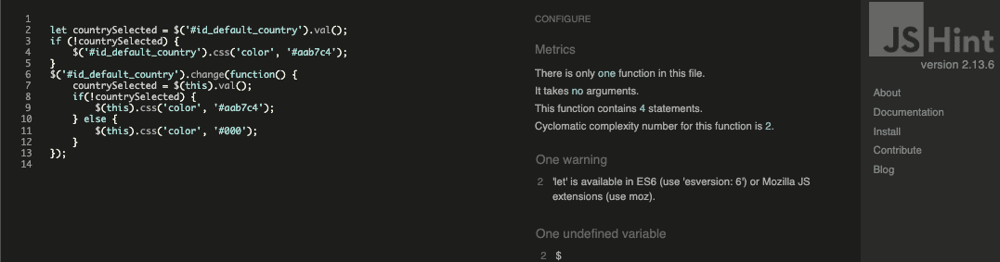
</details><br/>

[Back to top](<#contents>)

## Manual Testing

In addition to tests stated above I have performed a series of manual tests. Below the list of tests that has been conducted can be found.

| Status | **Main Website - User Signed Out**
|:-------:|:--------|
| &check; | Typing in a incorrect URL on the page loads the 404 error page
| &check; | Pasting page that needs authentication shows message that page is forbodden, loads a forbidden page or if this page accessable for sined in users - to the sign in page
| &check; | Clicking the nav logo loads the home page
| &check; | Clicking the shop now button loads the products page and lists all products
| &check; | Clicking the sorting button under the main navigation panel lists products and sorted accordingly
| &check; | Clicking the Sign In loads the sign in page
| &check; | Clicking the Sign Up loads the sign up page
| &check; | 12 products are rendered for the user on *Products* page before pagination kicks in
| &check; | Clicking the on the product card image loads the product detail page
| &check; | In the product details view the user cannot create a review and vote for rating
| &check; | In the post detail view the signed in user cannot add product to the wishlist
| &check; | The search input works as expected
| &check; | There is no access to the /admin page
| &check; | Clicking the Facebook link in the footer area opens Facebook page in a new window
| &check; | Clicking the Instagram link in the footer area opens Instagram page in a new window
| &check; | Clicking the GitHub link in the footer area opens GitHub page in a new window
| &check; | Clicking the Privacy Policy link in the footer area opens Privacy Policy in a new window

| Status | **Main Website - User Signed In**
|:-------:|:--------|
| &check; | Typing in a incorrect URL on the page loads the 404 error page
| &check; | Pasting page that needs administrator rights loads a forbidden page
| &check; | Clicking the nav logo loads the home page
| &check; | Clicking the shop now button loads the products page and lists all products
| &check; | Clicking the sorting button under the main navigation panel lists products and sorted accordingly
| &check; | 12 products are rendered for the user on *Products* page before pagination kicks in
| &check; | Clicking the on the product card image loads the product detail page
| &check; | In the product details view the user can create a review and vote for rating
| &check; | When user submits a review a message with approval information is being showed on the page
| &check; | In the product detail view the signed in user can delete the review created by themselves
| &check; | In the post detail view the signed in user can add product to the wishlist
| &check; | Clicking the Profile button in the signed in user menu loads the My Profile page
| &check; | There is no access to the /admin page
| &check; | Clicking the Facebook link in the footer area opens Facebook page in a new window
| &check; | Clicking the Instagram link in the footer area opens Instagram page in a new window
| &check; | Clicking the GitHub link in the footer area opens GitHub page in a new window
| &check; | Clicking the Privacy Policy link in the footer area opens Privacy Policy in a new window

| Status | **Main Website - Admin signed In**
|:-------:|:--------|
| &check; | Clicking the Create Product button in the signed in user menu loads the Create Product page
| &check; | Clicking the Review List button in the signed in user menu loads the Draft Reviews page
| &check; | The edit and delete buttons is visible in post detail view and leads to editing and delete confirmation
| &check; | The edit and delete buttons is visible in products page and leads to editing and delete confirmation
| &check; | The approve and delete buttons is visible in review list and leads to confirmation of deleteng or approving a review
| &check; | There is an access to the /admin page

 Status | **Create / Edit A Product - Admin signed In**
|:-------:|:--------|
| &check; | Category field is not required
| &check; | Sku field is not required
| &check; | Name field is required
| &check; | Name field does not accept just spaces
| &check; | Description field is required
| &check; | Description field does not accept just spaces
| &check; | Has sizes field is not required
| &check; | Price field is required
| &check; | Price field does not accept just spaces, cannot be more than 6 digits
| &check; | Rating field is required
| &check; | Rating field does not accept just spaces, should be from 1.00 to 5.00
| &check; | Image url field is not required

Status | **Create A New User - User signed Out**
|:-------:|:--------|
| &check; | Email fields is required
| &check; | Email fields does not accept empty field
| &check; | Email fields does not accept just spaces
| &check; | Username field is required
| &check; | Username field does not accept empty field
| &check; | Username field does not accept just spaces
| &check; | Password fields is required
| &check; | Password fields do not accept empty field
| &check; | Password fields do not accept just spaces
| &check; | Success flash message is displayed when the user submits a new user form

[Back to top](<#contents>)

## Responsiveness Test
The responsive design tests were carried out manually with [Google Chrome DevTools](https://developer.chrome.com/docs/devtools/) and [Am I Responsive](https://ui.dev/amiresponsive/).

| Desktop    | Display <1280px       | Display >1280px    |
|------------|-----------------------|--------------------|
| Render     | pass                  | pass               |
| Images     | pass                  | pass               |
| Links      | pass                  | pass               |

| Tablet     | Samsung Galaxy Tab 10 | Amazon Kindle Fire | iPad Mini | iPad Pro |
|------------|-----------------------|--------------------|-----------|----------|
| Render     | pass                  | pass               | pass      | pass     |
| Images     | pass                  | pass               | pass      | pass     |
| Links      | pass                  | pass               | pass      | pass     |

| Phone      | Galaxy S5/S6/S7       | iPhone 6/7/8       | iPhone 12pro         |
|------------|-----------------------|--------------------|----------------------|
| Render     | pass                  | pass               | pass      | pass     |
| Images     | pass                  | pass               | pass      | pass     |
| Links      | pass                  | pass               | pass      | pass     |

[Back to top](<#contents>)

## Browser Compatibility
* Google Chrome (version 114.0.5735.198)
* Mozilla Firefox (version 114.0.1)
* Opera (version 91.0.4516.20)
* Apple Safari (version 16.5.1)
* Microsoft Edge (version 114.0.1823.67)

[Back to top](<#contents>)

## Lighthouse
Google Lighthouse in Chrome Developer Tools was used to test the application within the areas of *Performance*, *Accessibility*, *Best Practices* and *SEO*. The testing showed the following:

<details><summary><b>Lighthouse Home Page Result</b></summary>


</details><br/>

<details><summary><b>Lighthouse Products Page Result</b></summary>


</details><br/>

<details><summary><b>Lighthouse Product Detail Page Result</b></summary>


</details><br/>

<details><summary><b>Lighthouse Profile Page Result</b></summary>


</details><br/>

<details><summary><b>Lighthouse Shopping Bag Result</b></summary>

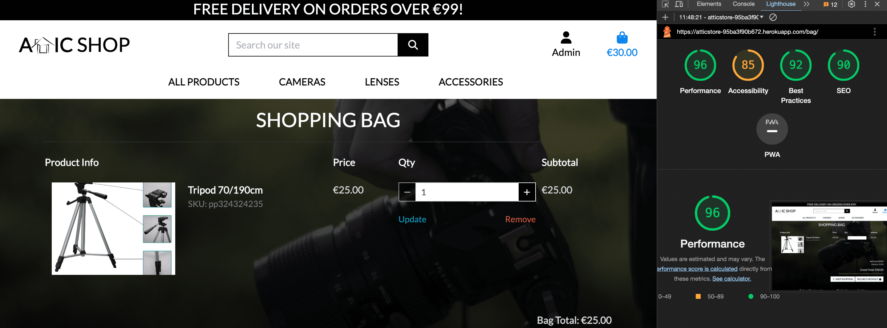
</details><br/>

<details><summary><b>Lighthouse Wishlist Result</b></summary>


</details><br/>

<details><summary><b>Lighthouse Checkout Page Result</b></summary>


</details><br/>

## Peer Review
Additional testing of the application was conducted by people outside of the software development field. Some smaller spelling and grammar errors were found and corrected. No issues connected to design or handling of the site.

[Back to top](<#contents>)

## Known bugs
No known bugs besides those in the fixed / unfixed bugs section.

### Fixed Bugs

* Bug: low accessibility because of buttons. Solution: add `aria-label` to describe button.

* Bug: HTML Validation shows errors about dublicating id's. Solution: add product primary keys to id's, or change id's to classes.

### Unfixed Bugs

* Bug: message success always shows shopping bag contents. Temporary solution: use message info instead.

* Bug: forget password doesn't work yet. Temporary solution: disable forget password functionality.

[Back to top](<#contents>)

# Deployment

## Deployment To Heroku

The project was deployed to [Heroku](https://www.heroku.com). To deploy, please follow the process below:

1. To begin with we need to create a GitHub repository from the [Code Institute template](https://github.com/Code-Institute-Org/gitpod-full-template) by following the link and then click 'Use this template'.

<details><summary><b>Heroku Deployment - Step 1</b></summary>


</details><br />

2. Fill in the needed details as stated in the screenshot below and then click 'Create Repository From Template'.

<details><summary><b>Heroku Deployment - Step 2</b></summary>


</details><br />

3. When the repository creation is done click 'Gitpod' as stated in the screenshot below.

<details><summary><b>Heroku Deployment - Step 3</b></summary>


</details><br />

4. Now it's time to install Django and the supporting libraries that are needed. Type the commands below to do this.

Core functionality:
* ```pip3 install 'django<4' gunicorn```
* ```pip3 install dj_database_url==0.5.0 psycopg2```
* ```pip3 install pillow```
* ```pip3 install django-allauth==0.41.0```
* ```pip3 install django-crispy-forms==1.14.0```
* ```pip3 install django-countries==7.2.1```
For secure payments:
* ```pip3 install stripe```
for Amazon AWS staticfiles storage:
* ```pip3 install boto3```
* ```pip3 install django-storages```
To validate python code:
* ```pip install flake8```
* ```pip install flake8-django```

<details><summary><b>Heroku Deployment - Step 4</b></summary>


</details><br />

5. When Django and the libraries are installed we need to create a requirements file.

* ```pip3 freeze --local > requirements.txt``` - This will create and add required libraries to requirements.txt

<details><summary><b>Heroku Deployment - Step 5</b></summary>


</details><br />

6. Now it's time to create the project.

* ```django-admin startproject YOUR_PROJECT_NAME .``` - This will create your project

<details><summary><b>Heroku Deployment - Step 6</b></summary>


</details><br />

7. When the project is created we can now create the application.

* ```python3 manage.py startapp APP_NAME``` - This will create your application

<details><summary><b>Heroku Deployment - Step 7</b></summary>


</details><br />

8. We now need to add the application to settings.py

<details><summary><b>Heroku Deployment - Step 8</b></summary>


</details><br />

9. Now it is time to do our first migration and run the server to test that everything works as expected. This is done by writing the commands below.

* ```python3 manage.py migrate``` - This will migrate the changes

<details><summary><b>Heroku Deployment - Step 9/1</b></summary>


</details><br />

* ```python3 manage.py runserver``` - This runs the server. To test it, click the open browser button that will be visible after the command is run and add host to allowed hosts in the `settings.py`:
```
ALLOWED_HOSTS = ['8000-sergiikostanets-attic-tpze2e5f7xn.ws-eu101.gitpod.io']
```

<details><summary><b>Heroku Deployment - Step 9/2</b></summary>


</details><br />

10. Now it is time to create our application on Heroku, attach a database, prepare our environment and settings.py file and setup the Amazon AWS storage for our static and media files.

* Head on to [Heroku](https://www.heroku.com/) and sign in (or create an account if needed).

* In the top right corner there is a button that is labeled 'New'. Click that and then select 'Create new app'.

<details><summary><b>Heroku Step 10</b></summary>


</details><br />

11. Now it's time to enter an application name that needs to be unique. When you have chosen the name, choose your region and click 'Create app".

<details><summary><b>Heroku Step 11</b></summary>


</details><br />

12. To add a database to the app you need to navigate to [ElephantSQL.com](https://www.elephantsql.com/) and click “Get a managed database today”. Select “Try now for FREE” in the TINY TURTLE database plan. Select “Log in with GitHub” and authorize ElephantSQL with your selected GitHub account. <br>In the Create new team form:
    * Add a team name (your own name is fine)
    * Read and agree to the Terms of Service
    * Select Yes for GDPR
    * Provide your email address
    * Click “Create Team”

13. At the [ElephantSQL.com](https://www.elephantsql.com/) click “Review”, check that your detail are correct. Then click “Create instance”. Return to the ElephantSQL dashboard and click on the database instance name for this project. Copy your ElephantSQL database URL using the Copy icon. It will start with `postgres://`.

14. Open your App in Heroku. Open  the settings tab. Click Reveal Config Vars. Add a Config Var called `DATABASE_URL`. The value should be the ElephantSQL database url you copied in the previous step.

15. Install a database url package: `pip3 install dj-database-url`. This package allows us to parse the database url that Heroku created. Refreeze the requirements file: `pip3 freeze --local > requirements.txt`. Get the url of the remote database `heroku config`. Displays the DATABASE_URL Config Var we just set on Heroku in the terminal (used below) (Copy this value)

16. Copy and Paste the DATABASE settings:
```
DATABASES = {
   'default': dj_database_url.parse('postgres://DATABASE_URL')
}
```

17. Import `dj_database_url` at top of `settings.py`:
```
from pathlib import Path
import dj_database_url
```

18. Run your migrations: `python3 manage.py migrate`

19. Go back to GitPod and create a new env.py in the top level directory. Then add these rows.

* ```import os``` - This imports the os library
* ```os.environ["DATABASE_URL"]``` - This sets the environment variables.
* ```os.environ["SECRET_KEY"]``` - Here you can choose whatever secret key you want.

<details><summary><b>Heroku Step 19</b></summary>


</details><br />

20. Now we are going to head back to Heroku to add our secret key to config vars. See screenshot below.

<details><summary><b>Heroku Step 20</b></summary>


</details><br />

21. Now we have some preparations to do connected to our environment and settings.py file. In the settings.py, add the following code:

```
import os
import dj_database_url
if os.path.exists('env.py'):
    import env
```

22. In the settings file, remove the insecure secret key and replace it with:
```SECRET_KEY = os.environ.get('SECRET_KEY')```

23. Save all your fields and migrate the changes.

```python3 manage.py migrate```

24. Now we are going to get our connection to Amazon AWS connection working (this is were we will store our static files). 
    * First you need to create an Amazon AWS account and S3 bucket, create user, user group and policy. Details can be found [here](https://learn.codeinstitute.net/courses/course-v1:CodeInstitute+EA101+2021_T1/courseware/eb05f06e62c64ac89823cc956fcd8191/40cc2543c48643fda09351da6fa90579/) and [here](chrome-extension://efaidnbmnnnibpcajpcglclefindmkaj/https://codeinstitute.s3.amazonaws.com/fullstack/AWS%20changes%20sheet.pdf).
    * Go back to the settings.py file in Gitpod and add settings for AWS bucket.

25. Let's head back to Heroku and add the API bucket keys in Config Vars. We also need to add a disable collectstatic variable to get our first deployment to Heroku to work.

<details><summary><b>Heroku Step 25</b></summary>


</details><br />

26. Let's head back to our settings.py file on Gitpod. We now need to add our Libraries we installed earlier to the installed apps. Here it is important to get the order correct.

<details><summary><b>Heroku Step 26</b></summary>

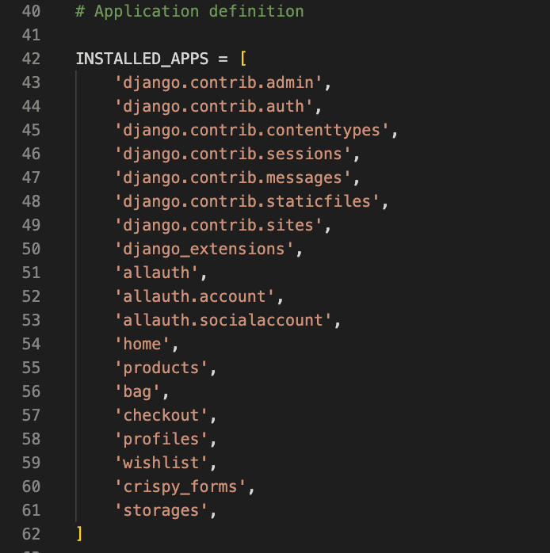
</details><br />

27. For Django to be able to understand how to use and where to store static files we need to add some extra rows to the settings.py file.

<details><summary><b>Heroku Step 27</b></summary>


</details><br />

28. Now it's time to link the file to the Heroku templates directory. Let's change the templates directory to TEMPLATES_DIR in the teamplates array.

<details><summary><b>Heroku Step 28</b></summary>

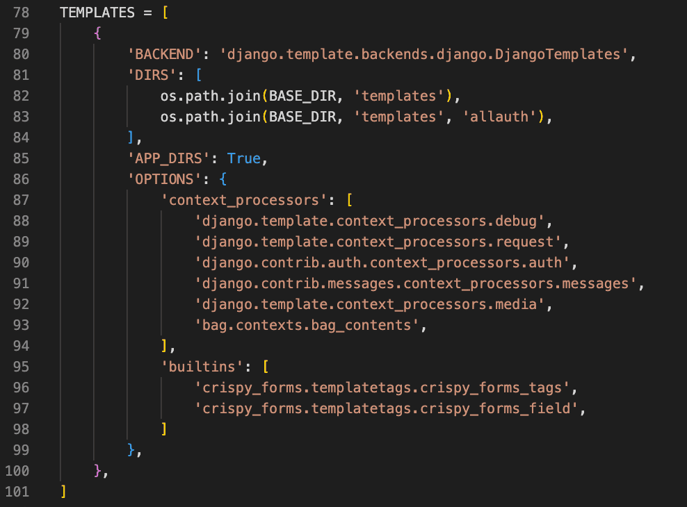
</details><br />

29. To be able to get the application to work through Heroku we also need to add our Heroku app and localhost to which hosts that are allowed.

<details><summary><b>Heroku Step 29</b></summary>


</details><br />

31. Now we just need to add some files to Gitpod.

* Create 3 folders in the top level directory: **media**, **static**, **templates**
* Create a file called *Procfile* and add the line ```web: gunicorn PROJ_NAME.wsgi``` to it

32. Now you can save all the files and prepare for the first commit and push to Github by writing the lines below.

* ```git add .```
* ```git commit -m "Deployment Commit```
* ```git push```

33. Before moving on to the Heroku deployment we just need to add one more thing in the config vars. We need to add "PORT" in the KEY input field and "8000" in the VALUE field. If we don't add this there might be problems with the deployment.

34. Now it's time for deployment. Scroll to the top of the settings page in Heroku and click the 'Deploy' tab. For deployment method, select 'Github'. Search for the repository name you want to deploy and then click connect.

35. Scroll down to the manual deployment section and click 'Deploy Branch'. Hopefully the deployment is successful!

<details><summary><b>Heroku Step 35</b></summary>


</details><br />

The live link to the *Attic Shop* site can be found [here](https://atticstore-95ba3f90b672.herokuapp.com/). <br>
The Github repository can be found [here](https://github.com/Sergii-Kostanets/attic).

[Back to top](<#contents>)

## Forking The Repository On GitHub

It is possible to do a independent copy of a GitHub Repository by forking the GitHub account. The copy can then be viewed and it is also possible to do changes in the copy without affecting the original repository. To fork the repository, take these steps:

1. After logging in to GitHub, locate the repository. On the top right side of the page there is a 'Fork' button. Click on the button to create a copy of the original repository.

<details><summary><b>Github Fork</b></summary>


</details><br />

[Back to top](<#contents>)

## Cloning And Setting Up This Project

To clone and set up this project you need to follow the steps below.

1. When you are in the repository, find the code tab and click it.
2. To the left of the green GitPod button, press the 'code' menu. There you will find a link to the repository. Click on the clipboard icon to copy the URL.
3. Use an IDE and open Git Bash. Change directory to the location where you want the cloned directory to be made.
4. Type 'git clone', and then paste the URL that you copied from GitHub. Press enter and a local clone will be created.

<details><summary><b>Github Create Local Clone</b></summary>


</details><br />

5. To be able to get the project to work you need to install the requirements. This can be done by using the command below:

* ```pip3 install -r requirements.txt``` - This command downloads and install all required dependencies that is stated in the requirements file.

6. The next step is to set up the environment file so that the project knows what variables that needs to be used for it to work. Environment variables are usually hidden due to sensitive information. It's very important that you don't push the env.py file to Github (this can be secured by adding `env.py` to the `.gitignore-file`). The variables that are declared in the `env.py` file needs to be added to the Heroku config vars. Don't forget to do necessary migrations before trying to run the server.

<details><summary><b>Setup env.py</b></summary>


</details><br />

* ```python3 manage.py migrate``` - This will do the necessary migrations.

7. Create Super User. Create username and password. The password will not appear on the screen as you type. Press Enter when you have finished typing the password.

* ```python3 manage.py createsuperuser```

8. Run the local server.

* ```python3 manage.py runserver``` - If everything i setup correctly the project is now live locally.

[Back to top](<#contents>)

# Credits

* All text content written by Sergii Kostanets.

* Images, logo, and icon for the website taken/created by Sergii Kostanets.

# Acknowledgements
This site was created for Portfolio Project #4 - Diploma in Full Stack Software Development Diploma at the [Code Institute](https://www.codeinstitute.net). I would like to thank my mentor [Precious Ijege](https://www.linkedin.com/in/precious-ijege-908a00168/) for relevant feedback during the project.

*Sergii Kostanets, 2023-10-09*

[Back to top](<#contents>)

