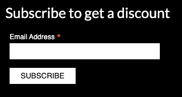

# **Attic Shop**

*Attic Shop* is a e-commerce project dedicated to cameras, lenses and accessories for them. All visitors can buy products, create their own user profile to start adding products to their wishlist and leave reviews. All reviews need approval by *Attic Shop* website owner so everyone can feel safe from abuse, inappropriate language, etc. The approvals are being made from website UI pages that only is accessed by website owner.

This website was created for Portfolio Project #5 - Diploma in Full Stack Software Development Diploma at the [Code Institute](https://www.codeinstitute.net).

[View live website here](https://atticstore-95ba3f90b672.herokuapp.com/)

# Contents

* [**Strategy**](<#strategy>)

    * [Site User Goals](<#site-user-goals>)
    
    * [Site Owner Goals](<#site-owner-goals>)
    
    * [Target Audience](#target-audience)
    
    * [Business Model](#business-model)
    
    * [SEO](#seo)
    
    * [Marketing](#marketing)
    
    * [Project Management](<#project-management>)

* [**User Experience (UX)**](<#user-experience-ux>)

    * [User Stories](<#user-stories>)

    * [Site Structure](<#site-structure>)

    * [Design Choices](<#design-choices>)

# Strategy

## Site User Goals

- Selecting products
- Searching for products
- Buying products
- Register or Login
- Review product
- Add product to the wishlist

## Site Owner Goals

- Sell products
- Get people to subscribe
- Promote own business
- Add products
- Edit products
- Delete products

## Target Audience

- Professional photographers
- Amateur photographers
- Experimental photographers
- Fans of rare film cameras

## Business Model

*Attic Shop* is designed as a minimalistic shop for cameras directly selling to the consumer (B2C). The user can order their products online and then the products will be shipped to them.

There is the subscribtion for the future for discounts and the newsletter with information about new cameras, lenses and accessories.

The most popular social platforms Facebook and Instagram are used to communicate with potential buyers.

## SEO

Keywords, title and description meta tags have been added for SEO.

Descriptive urls have been used for the main site navigation to be more SEO friendly.

File `robots.txt` created to improve SEO.

File `sitemap.xml` created with [Free Online Sitemap Generator](https://www.xml-sitemaps.com/).

## Marketing

### Facebook

There is a Facebook page for *Attic Shop*. The shop can post new products and advertise discounts with the Facebook instruments.

[View live Attic Shop Facebook page here](https://www.facebook.com/atticcamerashop/)

<b>Facebook Page</b>

 

### Instagram

There is an Instagram page for *Attic Shop*. The shop can post new products and advertise discounts with the Instagram instruments.

[View live Attic Shop Instagram page here](https://www.instagram.com/cherdackshopblog/)

<b>Instagram Page</b>

 

### Newsletter

Users can subscribe to a newsletter to stay up to date with what is happening and get dicounts. Service provided by [Mailchimp](https://mailchimp.com/).

<b>Newsletter</b>

 

### Additional

There is the possibilities for more social media pages and running google ads to increase visibility.
Contests could be hosted to win prices and bring more people to join the newsletter.

## Project Management

### Github Board
I've been using the project board in GitHub to keep my project together. It helped me structure up my work. GitHub was used to plan and organize my user stories.

<b>User Stories</b>

 

[Back to top](<#contents>)

### Database Schema
I've used a modelling tool called [Graph Models](https://django-extensions.readthedocs.io/en/latest/graph_models.html) to create the database schema. It shows the relationships between the different models in the database connected to the application. Graph Models exports a *.png file which visualize models.

Models used (besides standard user model) in this project are:

* **Category** - Handles all the categories in the products application.
* **Product** - Handles all the products for categories in the products application.
* **Review** - Handles all the reviews for products in the products application.
* **SizeCategory** - Handles type of size for their categiry in the products application.
* **ProductSize** - Handles all the product sizes for their size category in the products application.
* **Wishlist** - Handles all the products in the wishlist of user in the wishlist application.
* **UserProfile** - Handles all the profiles for users in the profiles application.
* **Order** - Handles all the orders for user profile in the checkout application.
* **OrderLineItem** - Handles all the items for the order in the checkout application.

<b>Database Schema Small</b>

 

<b>Database Schema Full</b>

 

# **User Experience (UX)**

## User Stories
Below the user stories for the project are listed to clarify why particular feature matters. These will then be tested and confirmed in the [Testing](<#testing>) section.

### Site User

| Role | Case |  |
|:-------:|:--------|:--------|
| As a Site User | I can view a list of products so that I can select one to view | &check; |
| As a Site User | I can view a paginated list of products so that easily select a page to view | &check; |
| As a Site User | I can click on a product so that I can read the full description | &check; |
| As a Site User | I can register an account so that I can use additional functionality | &check; |
| As a Site User | I can sign out from the site so that I can be safe that nobody can access my information | &check; |
| As a Site User | I can search for products so that I can filter products that match my interests | &check; |
| As a Site User | I can edit amount of product items so that I can add this amount to the bag at once | &check; |
| As a Site User | I can add products to the shopping bag so that I can buy them later | &check; |
| As a Site User | I can edit amount of product items in the bag so that I can buy this amount at once | &check; |
| As a Site User | I can add products to the wishlist so that I can add them to the shopping bag later | &check; |
| As a Site User | I can see my profile so that I can edit my delivery details | &check; |
| As a Site User | I can see order history so that I can control my purchases | &check; |
| As a Site User | I can go to chackout page so that I can make a payment | &check; |
| As a Site User | I can see order information page so that I have confirmation of payment | &check; |
| As a Site User | I can write a review so that I can share my opinion about the product | &check; |
| As a Site User | I can sort products by different characteristics so that I can easily choose product I want to buy | &check; |
| As a Site User | I can rate the product so that I can influence on product raiting | &check; |
| As a Site User | I can view specific cetegory so that I can look for products only in that category | &check; |
| As a Site User | I can remove item from the bag so that I can discard bying them | &check; |
| As a Site User | I can see massages about editing my shopping bag so that I can confim success of my actions | &check; |
| As a Site User | I can see products in the bag in the success message so that I can be sure product is added or removed from the bag | &check; |
| As a Site User | I can enter payment information so that I can check out | &check; |
| As a Site User | I can be sure my personal and payment information is safe and secure so that I can confidently provide the needed information to make a purchase | &check; |
| As a Site User | I can receive an email confirmation after checking out so that I can keep the information of what I've purchased for my records | &check; |
| As a Site User | I can get an email confirmation so that I can be sure my order details is saved | &check; |

### Store Owner

| Role | Case |  |
|:-------:|:--------|:--------|
| As a Store Owner | I can add a product to the store so that I can expand the range of products | &check; |
| As a Store Owner | I can edit a product so that I can keep a product up to date | &check; |
| As a Store Owner | I can delete a product so that I can remove irrelevant products | &check; |
| As a Store Owner | I can approve draft reviews so that I can keep reviews polite and actual | &check; |

[Back to top](<#contents>)

## Site Structure

The *Attic Shop* site has: **Home Page** for *announcements*, **Products Page** for *products*, **Wishlist** for *products to add to the bag later*, **Shopping Bag** for *products to create an order*, **Checkout Page** for *order to pay*, and **Profile Page** for *profile details*.

The functionality is alo different **when the user is signed out** and **when the user is signed in**. Depending on login status different pages is available for the user.

When the user is signed out the pages: *Sign In*, *Sign Up*, *Home*, *Products*, and *Shopping Bag* are avaliable. Dropdown menu without username shows: *Sign In*, and *Sign Up* links.

When the user is signed in dropdown menu with username shows: *Profile*, *Wishlist*, and *Sign Out* links. 

If you are signed in as an administrator an *admin area* is available: *Create Product*, and *Review List*.

The site has an minimalistic, clean and intuitive design that makes the site easy to navigate for the user.

Read more about the different choices in the [Features](<#features>) section.

[Back to top](<#contents>)

## Design Choices

### Color Scheme

The color scheme chosen for the *Attic Shop* site is contrast black and white with interactive elements based on the Bootstrap 4.6 default colours. The colors are chosen in such a way that the background contrasts with the elements with which you can interact, the color of the buttons reflects their purpose, and the use of the functionality is as intuitive as possible. All colors are very clean and they create a professional look together and offers a good readability and contrast as well. I used the online service [Coolors](https://coolors.co/) to choose the color scheme.

<b>Color Palette Image</b>

 

### Typography
The font used for the site are one of the most popular fonts: 'Lato'. Lato is a humanist sans-serif typeface designed by Łukasz Dziedzic. It was released in 2010. The name "Lato" is Polish for "summer". Fallback font is sans-serif.

[Back to top](<#contents>)

